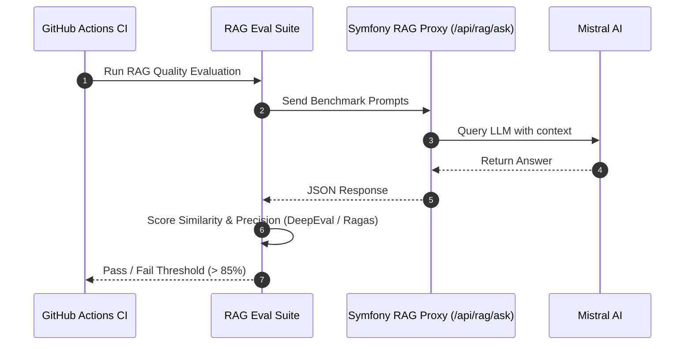

# Architectural Decision Records (ADR) & Engineering Strategy

## 0. Matrice d'Arbitrage et Priorités du Projet

### Classement des Critères par Priorité :
1. **Fiabilité** (Sécurité, typage strict, aucune donnée invalide en base)
2. **Simplicité** (Maintenance aisée, stack maîtrisée)
3. **Vitesse de livraison** (Time-to-market rapide)
4. **Évolutivité** (Capacité à scaler et faire évoluer les contrats)
5. **Coût** (TCO sur 3 ans)

### Sacrifices Explicites :
* **Sacrifice du sur-découplage prématuré :** Nous sacrifions l'architecture microservices au profit d'un monolithe modulaire Symfony 7 / API Platform 4 / React. Cela permet d'avoir la vitesse de livraison et la simplicité tout en garantissant la fiabilité.
* **Sacrifice du multicloud :** Nous privilégions la conteneurisation Docker / Traefik / Caddy sur serveur dédié/VPS Debian plutôt que des architectures Kubernetes complexes.

---

## 1. Fiabilité : Réduire les Bugs par Construction

### Classes de bugs éliminées par construction :
* **Typage & Nullabilité :** PHP 8.3 / Symfony 7 avec `declare(strict_types=1)` et propriétés typées strictes élimine les erreurs de type `TypeError` et `Call to a member function on null`.
* **Validation aux frontières :** API Platform + Symfony Validator intercepte les requêtes JSON-LD aux frontières de l'API. Aucune donnée ne franchit le contrôleur sans valider les contraintes `#[Assert\Email]`, `#[Assert\NotBlank]`, etc.

### Ce qui reste à couvrir par les tests :
* Les règles métier complexes multi-entités, les autorisations de sécurité transversales (RBAC), les effets de bord d'état et les comportements Asynchrones.

### Niveau de Typage Strict :
* **PHPStan Niveau 8/9** imposé en CI.
* **Coût réel :** ~5% de temps de développement supplémentaire au début, économisant 80% de temps de débuggage en production.

### Validation des données entrantes :
* Placé au niveau des **DTOs (Data Transfer Objects)** et des attributs de validation Symfony Validator.

---

## 2. Évolutivité : Pouvoir Changer Sans Tout Casser

### Étanchéité des modules :
* Utilisation de **Deptrac** en CI pour interdire les dépendances directes entre sous-domaines (ex: `Product` ne doit pas dépendre directement de `Notification`).

### Migrations de schéma sans interruption (Expand / Contract) :
1. **Phase Expand :** Ajouter la nouvelle colonne en `NULLABLE`.
2. **Phase Migrate :** Déployer le code applicatif qui écrit dans l'ancienne et la nouvelle colonne.
3. **Phase Contract :** Remplir les données existantes via une commande console, puis passer la colonne en `NOT NULL` et supprimer l'ancienne dans une version ultérieure.
* **Rollback :** Si la migration échoue, la transaction PostgreSQL s'annule automatiquement. En cas d'échec post-déploiement, les sauvegardes journalières `backup.sh` permettent un RTO < 1h.

### Versionnement de l'API :
* Versionnement par URI `/api/v1/...` ou Header HTTP `Accept: application/vnd.app.v2+json`.

---

## 3. Observabilité : Savoir Ce Qui Se Passe en Prod

### Stack d'observabilité minimale auto-hébergeable :
* **Logs structurés JSON :** Monolog configuré pour émettre du JSON structuré sur `stdout`.
* **Traces & Métriques :** **OpenTelemetry (OTel)** + **Prometheus & Grafana** conteneurisés en local/prod.

### 3 à 5 indicateurs de service (SLO) :
1. **Disponibilité HTTP (SLO 99.9%) :** Taux de réponses HTTP 2xx/3xx vs 5xx.
2. **Latence P95 (< 200ms) :** Latence des réponses API au 95ème percentile.
3. **Taux d'erreur JS Client (< 0.1%) :** Capturé via `/api/client_logs`.

---

## 4. Déploiement, Feature Flags & RPO/RTO

### Déploiement sans impact utilisateur :
* **Feature Flags :** Utilisation de `Bandwagon` ou variables d'environnement dynamiques.
* **Rollback en 1 commande :** `docker compose rollback` ou redéploiement du commit Git précédent via CI/CD.

### Objectifs RPO / RTO :
* **RPO (Recovery Point Objective) :** < 24h (Backups PostgreSQL quotidiens via `backup.sh`).
* **RTO (Recovery Time Objective) :** < 1 heure (Restauration automatisée des volumes Docker).

---

## 5. Sécurité, Souveraineté & RGPD

### Gestion des secrets :
* Secrets d'environnement gérés via `.env.local` en dev et variables d'environnement chiffrées SSH / GitHub Secrets en prod. Clés RSA JWT générées localement dans `backend/config/jwt/`.

### Souveraineté & RGPD :
* Données hébergées en France/UE sur serveur Debian (ex: Scaleway/Hetzner/OVH).
* Hébergement souverain évitant le CLOUD Act américain.

---

## 6. Maintenance & TCO sur 3 ans

### Cycle de vie des briques :
* **Symfony 7 (LTS) :** Support jusqu'en 2028.
* **PostgreSQL 16 :** Support jusqu'en 2028.
* **Node.js 20 :** Support jusqu'en 2026.

### Compétences & Recrutement :
* Stack standard PHP / Symfony / React bénéficiant du plus grand vivier de développeurs en France/Europe. Autonomie d'un dev confirmé en < 3 jours.

---

## 7. Évaluation de l'IA (RAG & Mistral) en CI

### Évaluation automatique :
* **Prompt Versioning :** Les prompts système sont versionnés dans le code sous `backend/src/Controller/RagController.php`.
* **CI Benchmark :** Un jeu de tests de référence ("Golden Dataset") évalue le score de fidélité contextuelle du RAG.
* **Modèle de repli :** Fallback automatique sur le moteur RAG local si Mistral AI est indisponible ou hors ligne.
