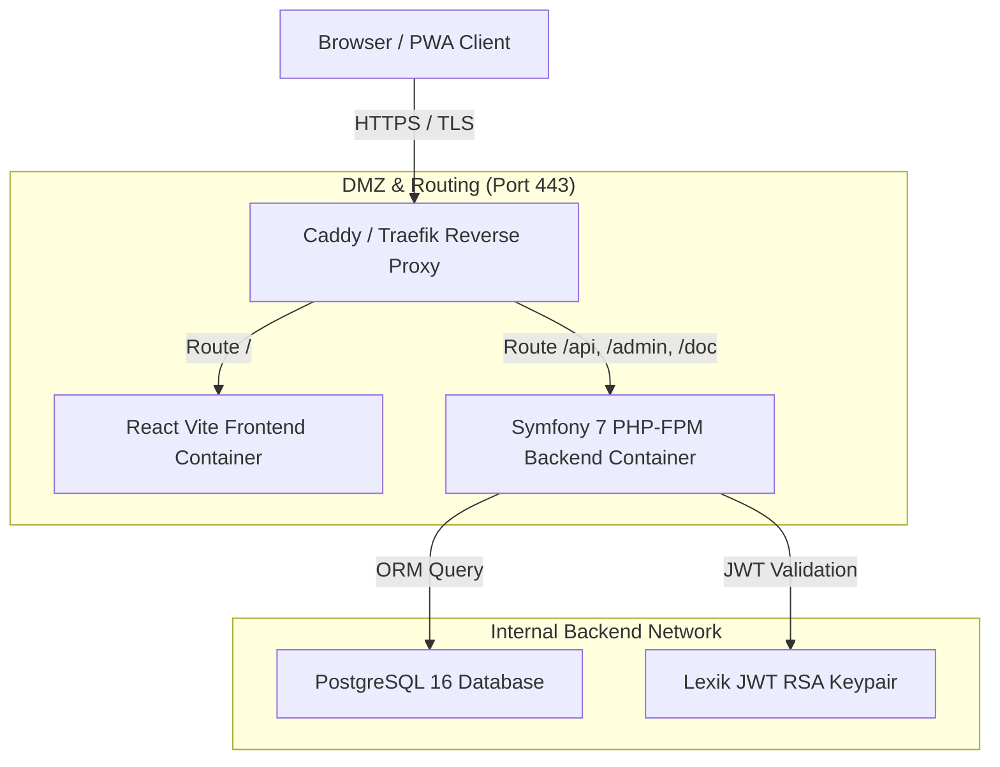
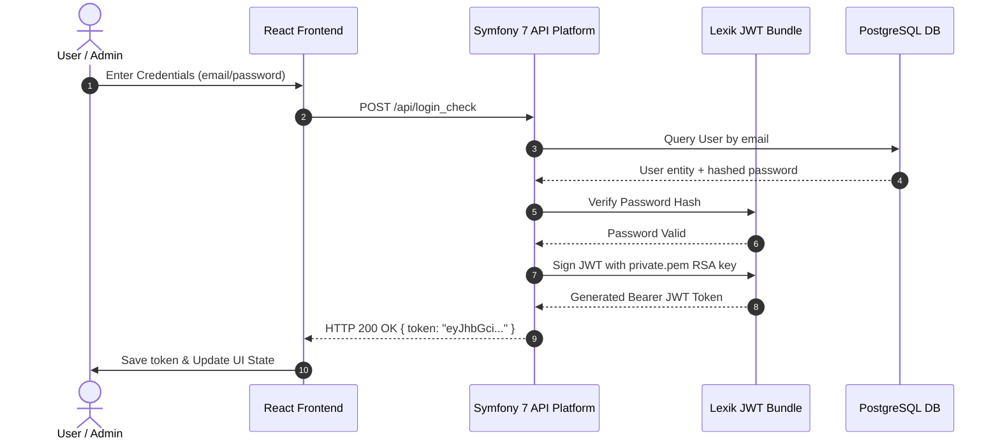
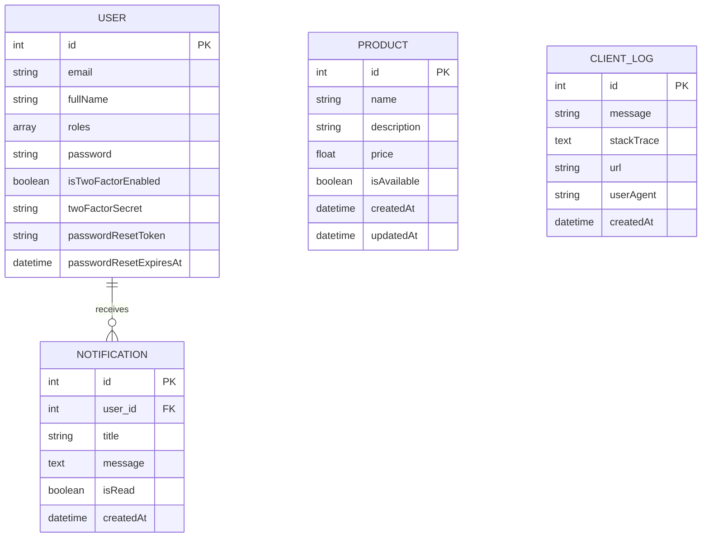

# 3-Tier TLS Platform - Architecture Documentation

## 1. System Topology Overview

```mermaid
graph TD
    Client[Browser / PWA Client] -->|HTTPS / TLS| ReverseProxy[Caddy / Traefik Reverse Proxy]

    subgraph "DMZ & Routing (Port 443)"
        ReverseProxy -->|Route /| FrontendContainer[React Vite Frontend Container]
        ReverseProxy -->|Route /api, /admin, /doc| BackendContainer[Symfony 7 PHP-FPM Backend Container]
    end

    subgraph "Internal Backend Network"
        BackendContainer -->|ORM Query| DB[PostgreSQL 16 Database]
        BackendContainer -->|JWT Validation| JWTKeys[Lexik JWT RSA Keypair]
    end
```

## 2. JWT Authentication Sequence

```mermaid
sequenceDiagram
    autonumber
    actor User as User / Admin
    participant React as React Frontend
    participant Symfony as Symfony 7 API Platform
    participant Lexik as Lexik JWT Bundle
    participant DB as PostgreSQL DB

    User->>React: Enter Credentials (email/password)
    React->>Symfony: POST /api/login_check
    Symfony->>DB: Query User by email
    DB-->>Symfony: User entity + hashed password
    Symfony->>Lexik: Verify Password Hash
    Lexik-->>Symfony: Password Valid
    Symfony->>Lexik: Sign JWT with private.pem RSA key
    Lexik-->>Symfony: Generated Bearer JWT Token
    Symfony-->>React: HTTP 200 OK { token: "eyJhbGci..." }
    React->>User: Save token & Update UI State
```

## 3. Entity Relationship Diagram (ERD)

```mermaid
erDiagram
    USER ||--o{ NOTIFICATION : receives
    USER {
        int id PK
        string email
        string fullName
        array roles
        string password
        boolean isTwoFactorEnabled
        string twoFactorSecret
        string passwordResetToken
        datetime passwordResetExpiresAt
    }

    PRODUCT {
        int id PK
        string name
        string description
        float price
        boolean isAvailable
        datetime createdAt
        datetime updatedAt
    }

    CLIENT_LOG {
        int id PK
        string message
        text stackTrace
        string url
        string userAgent
        datetime createdAt
    }

    NOTIFICATION {
        int id PK
        int user_id FK
        string title
        text message
        boolean isRead
        datetime createdAt
    }
```
