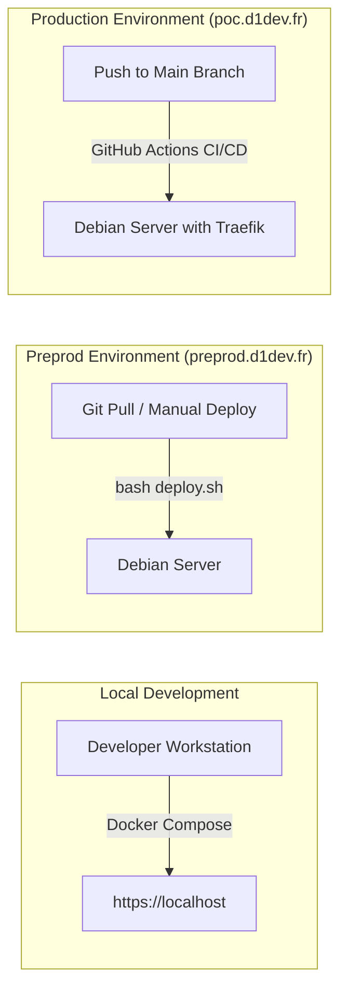
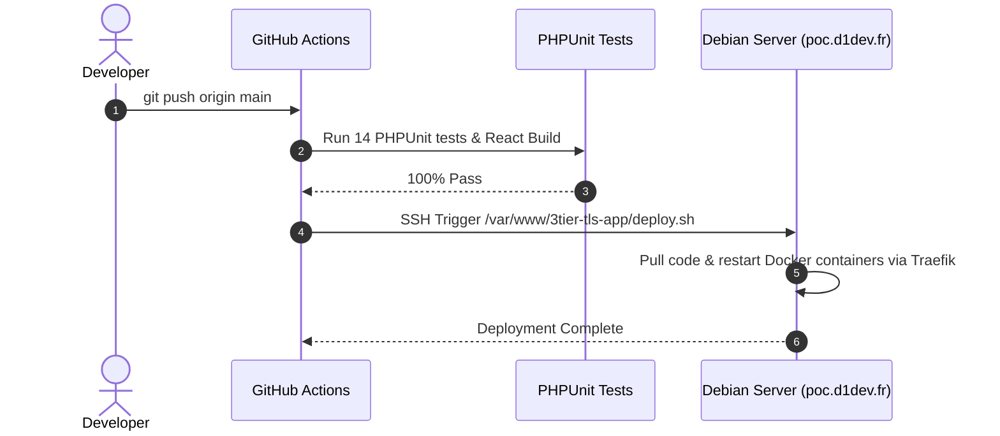

# Deployment Architecture - Preprod & Prod

## Deployment Environments

```mermaid
graph LR
    subgraph "Local Development"
        Dev[Developer Workstation] -->|Docker Compose| DevApp[https://localhost]
    end

    subgraph "Preprod Environment (preprod.d1dev.fr)"
        PreprodGit[Git Pull / Manual Deploy] -->|bash deploy.sh| PreprodServer[Debian Server]
    end

    subgraph "Production Environment (poc.d1dev.fr)"
        MainBranch[Push to Main Branch] -->|GitHub Actions CI/CD| ProdServer[Debian Server with Traefik]
    end
```

## Production CI/CD Pipeline Flow

```mermaid
sequenceDiagram
    autonumber
    actor Dev as Developer
    participant GitHub as GitHub Actions
    participant PHPUnit as PHPUnit Tests
    participant Server as Debian Server (poc.d1dev.fr)

    Dev->>GitHub: git push origin main
    GitHub->>PHPUnit: Run 14 PHPUnit tests & React Build
    PHPUnit-->>GitHub: 100% Pass
    GitHub->>Server: SSH Trigger /var/www/3tier-tls-app/deploy.sh
    Server->>Server: Pull code & restart Docker containers via Traefik
    Server-->>GitHub: Deployment Complete
```
