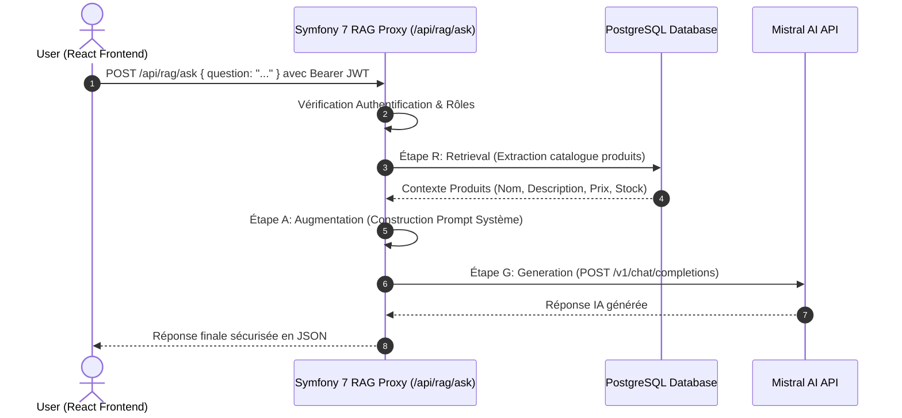

# Architecture Proxy RAG (Retrieval-Augmented Generation) & LLM

Dans une architecture 3-tiers moderne, le **Frontend React** ne doit jamais exposer les clés API des modèles d'IA (ex: **Mistral AI**) ni interroger directement l'IA.

Le **Backend Symfony 7** sert de **Proxy Sécurisé & Moteur RAG** :

---

## Avantages de l'Architecture Proxy RAG :
1. **Sécurité des Clés API :** La clé `MISTRAL_API_KEY` reste 100% côté serveur dans le conteneur Backend Symfony.
2. **Contrôle d'Accès :** Seuls les utilisateurs authentifiés via JWT (`ROLE_USER`) peuvent interroger l'IA.
3. **Protection contre le Prompt Injection :** Le Backend nettoie et valide la question de l'utilisateur avant de l'envoyer au LLM.
4. **Contextualisation des Données Métier :** Le Backend enrichit dynamiquement la question avec les données temps réel issues de la base PostgreSQL.
