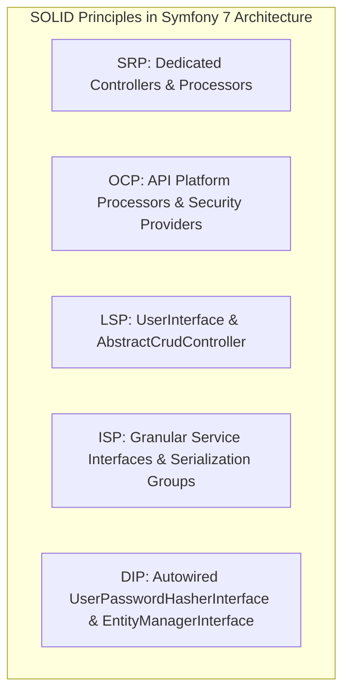

# Application des Principes SOLID dans la Plateforme 3-Tiers

L'architecture backend Symfony 7 et frontend React respecte rigoureusement les **5 principes SOLID** pour garantir la maintenabilité, la testabilité et la scalabilité du code.

---

## 1. Single Responsibility Principle (SRP) - Principe de Responsabilité Unique
> *"Une classe ou un composant ne doit avoir qu'une seule raison de changer."*

* **Backend (Symfony 7) :**
  * **Controllers (`HealthController`, `ProfileController`, `DocController`)** : Chaque contrôleur gère uniquement ses requêtes HTTP dédiées sans mélanger la logique métier ou le hachage.
  * **`UserPasswordHasherProcessor`** : Unique responsabilité : intercepter les écritures utilisateur via API Platform pour hasher le mot de passe avant la persistance Doctrine.
  * **Entities (`User`, `Product`, `ClientLog`, `Notification`)** : Entités purement déclaratives définissant le schéma de données et la validation constraints.
* **Frontend (React) :**
  * **`logger.js`** : Dédié uniquement à la capture et l'envoi des erreurs JavaScript/fetch vers le backend.
  * **Formulaires & Modales** : Modales indépendantes (`ProfileModal`, `ResetPasswordModal`, `LoginModal`) isolant la logique de saisie.

---

## 2. Open/Closed Principle (OCP) - Principe Ouvert/Fermé
> *"Les entités logicielles doivent être ouvertes à l'extension, mais fermées à la modification."*

* **Extension d'API Platform :**
  * Utilisation des **State Processors** (`UserPasswordHasherProcessor`) et **State Providers** sans modifier le cœur d'API Platform ou surcharger la logique interne du framework.
* **Security Firewalls :**
  * L'extension des droits d'accès se fait déclarativement via `security.yaml` et les annotations `#[IsGranted()]` sur les entités sans altérer le moteur d'authentification.
* **Reverse Proxy Modularité :**
  * La topologie supporte Caddy (`docker-compose.yml`) et Traefik (`docker-compose.traefik.yml`) via extension sans réécrire l'application.

---

## 3. Liskov Substitution Principle (LSP) - Principe de Substitution de Liskov
> *"Les sous-classes doivent pouvoir remplacer leurs classes mères sans altérer le fonctionnement du programme."*

* **Entités & Interfaces Symfony Security :**
  * `User` implémente `UserInterface` et `PasswordAuthenticatedUserInterface`. Tout composant du framework Security (Lexik JWT, PasswordHasher) interagit avec l'interface sans connaître l'implémentation exacte de `User`.
* **EasyAdmin CRUD Controllers :**
  * `UserCrudController` et `ProductCrudController` étendent `AbstractCrudController`. Ils peuvent remplacer n'importe quel CRUD controller générique du framework EasyAdmin 5 sans casser le tableau de bord.

---

## 4. Interface Segregation Principle (ISP) - Principe de Ségrégation des Interfaces
> *"Aucun client ne doit être forcé de dépendre d'interfaces qu'il n'utilise pas."*

* **Injection de Dépendances Symfony :**
  * Les contrôleurs et services n'injectent que les interfaces minimales nécessaires (ex: `EntityManagerInterface` pour la persistance, `UserPasswordHasherInterface` pour le hachage) plutôt que des conteneurs globaux monolithiques.
* **API Contracts (OpenAPI / Swagger) :**
  * Groupes de sérialisation `@Groups(['user:read', 'user:write'])` isolant les champs exposés en lecture et écriture pour chaque rôle sans imposer de payload inutile.

---

## 5. Dependency Inversion Principle (DIP) - Principe d'Inversion des Dépendances
> *"Les modules de haut niveau ne doivent pas dépendre des modules de bas niveau. Les deux doivent dépendre d'abstractions."*

* **Inversion de Contrôle (IoC) via Autowiring :**
  * `ProfileController` et `UserCrudController` dépendent de l'abstraction `UserPasswordHasherInterface` et `EntityManagerInterface`, non d'une implémentation concrète de hachage de mot de passe ou de driver PostgreSQL.
* **Doctrine Repositories :**
  * Découplage de la couche d'accès aux données : les contrôleurs interrogent les dépôts (`UserRepository`, `ProductRepository`) via le conteneur de services Symfony.

---

